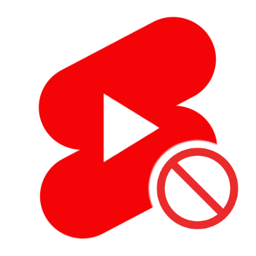

  
  <h1>YouTube Shorts Blocker</h1>

**YouTube Shorts Blocker** is a simple, open-source browser extension for [Chrome](https://chromewebstore.google.com/detail/jchbbofddpgfbaheknainnhbdonkpogf) and [Firefox](https://addons.mozilla.org/firefox/addon/youtube-shorts-blocker-hotay/) that removes YouTube Shorts from your feed. With a single toggle button, you can choose to block or allow YouTube Shorts, helping you focus on longer content.

## Features
- **Toggle Button**: Quickly turn YouTube Shorts on or off.
- **Distraction-Free Browsing**: Focus on long-form content without short video interruptions.
- **Multilingual Support**: Available in **English**, **Brazilian Portuguese**, **Spanish**, **German**, **Italian**, and **French**.

## Installation
The extension is available on the [Chrome Web Store](https://chromewebstore.google.com/detail/jchbbofddpgfbaheknainnhbdonkpogf) and [Firefox Add-ons](https://addons.mozilla.org/firefox/addon/youtube-shorts-blocker-hotay/).

## Usage
1. Install the extension from your browser’s extension store.
2. Click the extension icon in your browser toolbar.
3. Toggle **On** to block YouTube Shorts or **Off** to allow them.

## Contributing
Contributions are welcome! If you’d like to improve the extension or add new languages:
1. Fork this repository.
2. Create a new branch for your changes.
3. Submit a pull request.

---

Stay focused and enjoy longer content with **YouTube Shorts Blocker**!
